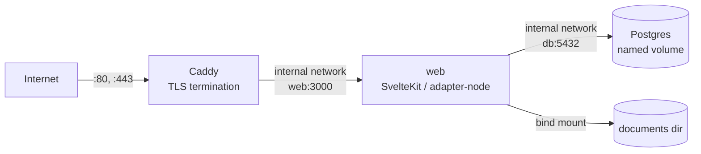

# Production deployment (#76)

This is the second stack alongside the one in AGENTS.md's "Local development"
section, not a replacement for it. `compose.yaml` is still what `pnpm dev` uses: a
bare Postgres for local work. `compose.prod.yaml` is a separate file, with its own
compose project name (`mastro-prod`, vs. `mastro` for dev) so the two can run
side by side without colliding, describing the actual production shape: the app
image built from `Dockerfile`, Postgres on a named volume, and a reverse proxy as
the only thing the network can reach.

## The shape



- **`web`** is built from the repository's `Dockerfile` — a multi-stage build so the
  shipped image never carries `svelte-check`, `eslint`, `vite`, `drizzle-kit` or any
  other devDependency, only the three runtime dependencies in `package.json`
  (`better-auth`, `drizzle-orm`, `postgres`). It publishes to
  `127.0.0.1:${WEB_PORT}:3000` — loopback only.
- **`db`** is `postgres:16-alpine` on the named volume `pgdata`, publishing no port
  at all: nothing but `web` and the backup scripts need to reach it, and both do so
  over the compose network by service name (`db`), never through the host.
- **`proxy`** is Caddy, the only service with `ports:` bound to every interface. It
  terminates TLS and reverse-proxies to `web:3000` over the same internal network.
  It also mounts `deploy/Caddyfile` as `/etc/caddy/Caddyfile`.

## The trap, and why this avoids it

Publishing a container port with `ports: - "3000:3000"` binds `0.0.0.0` by default.
Docker inserts its own iptables/nftables DNAT rules for that ahead of the host
firewall's `INPUT` chain, so a host firewall that is configured to block 3000 does
not actually block it — the packet is redirected before the firewall rule is ever
consulted. This is a well-known Docker footgun, not specific to this project.

`compose.prod.yaml` avoids it two ways: `web`'s only published port is explicitly
prefixed `127.0.0.1:`, so the DNAT rule only matches traffic already arriving on
loopback; and `db` publishes no port at all, so there is no rule to misconfigure in
the first place. Only `proxy` publishes to every interface, deliberately — it is
the one thing meant to face the internet.

## Secrets

`.env.prod` (copy from `.env.prod.example`, `chmod 600 .env.prod`) holds every
secret: `POSTGRES_PASSWORD`, `BETTER_AUTH_SECRET`, `GOOGLE_CLIENT_SECRET`. It is
never read by `Dockerfile` — `.dockerignore` excludes every `.env*` file from the
build context — so no secret can end up baked into an image layer, and `docker
history`/`docker inspect` on the built image show only the placeholder values the
build stage uses for SvelteKit's postbuild analysis step (see the comment in
`Dockerfile`; those are compile-time only and are discarded when the final
`runtime` stage starts fresh `FROM node:24-alpine`, not built `FROM build`).
Secrets reach the running containers at start, through `env_file: - .env.prod` in
compose, read once by Docker at container creation, never present in the image
itself.

```bash
cp .env.prod.example .env.prod
chmod 600 .env.prod
$EDITOR .env.prod
```

## Bringing the stack up

```bash
docker compose -f compose.prod.yaml --env-file .env.prod up -d --build
```

Migrations run on boot: the `web` container's entrypoint is
`node scripts/migrate.ts && exec node build` — the exact same migration runner and
the exact same committed SQL under `drizzle/` that `pnpm db:migrate` runs in local
development, so there is no second migration path that could drift from the first.

## What was proved locally

Run on this box, `MASTRO_SITE_ADDRESS=localhost` and `MASTRO_TLS_ARG=internal`
(Caddy's self-signed local CA, since there is no real public domain here), proxy
published on `8080`/`8443` instead of `80`/`443` to avoid needing root or colliding
with other services already running on this shared box. Production would use a real
domain, an email for Let's Encrypt, and ports 80/443 (both required: 80 for the ACME
challenge and the redirect Caddy adds by default).

**Unreachable except through the proxy:**

```
$ docker compose -f compose.prod.yaml --env-file .env.prod ps
NAME                  PORTS
mastro-prod-db-1      5432/tcp
mastro-prod-proxy-1   0.0.0.0:8080->80/tcp, 0.0.0.0:8443->443/tcp
mastro-prod-web-1     127.0.0.1:3001->3000/tcp

$ curl -sk https://localhost:8443/health
{"status":"ok","database":"ok"}                    # through the proxy: works

$ curl --max-time 3 http://<this host's public IP>:3001/health
curl: (7) Failed to connect                         # web's port, from off-box: refused

$ ss -tlnp | grep -E ':3001|:8080|:8443'
LISTEN 0.0.0.0:8443     # proxy, every interface — the one thing meant to be
LISTEN 127.0.0.1:3001   # web, loopback only
LISTEN 0.0.0.0:8080     # proxy, http (redirects to https)
```

`db` publishes no port, so there was nothing to check there beyond `docker compose
ps` showing no host mapping. A TCP connection to the proxy's port from the box's
real public interface (not just loopback) also succeeded (the TLS handshake itself
then fails with a certificate-hostname mismatch, because the self-signed local
certificate is scoped to `localhost` — expected for this rehearsal, and irrelevant
to the point being proved, which is that the port is genuinely open on every
interface and `web`'s is not).

**`docker compose restart`:** ran it against all three services; all three come back
and `GET /health` through the proxy returns `{"status":"ok","database":"ok"}`
afterward.

**The reboot claim, stated honestly:** I did not reboot this box, and would not —
it is shared with other work in progress. What actually guarantees the stack
survives a reboot is two independent, already-verified facts rather than a reboot
test: every service in `compose.prod.yaml` is `restart: unless-stopped`, which tells
the Docker daemon to restart a container that was running (not manually stopped)
whenever the daemon itself (re)starts; and `systemctl is-enabled docker` on this box
reports `enabled`, meaning `docker.service` itself is started by systemd on boot
without anyone asking it to. Chained together — the daemon starts because systemd
starts it, and the daemon then restarts every `unless-stopped` container that was
running when it last saw them — this is the standard, documented mechanism a reboot
relies on, and I tested container restart (`docker compose restart`) directly and
daemon-triggered restart indirectly (`systemctl is-enabled`), rather than the
reboot itself.

**Secrets file permissions:** `chmod 600 .env.prod` was applied, and `.env.prod` is
excluded from the Docker build context by `.dockerignore` and from git by
`.gitignore` (`.env.*`, with `.env.example`/`.env.prod.example` explicitly
un-ignored as the templates).

## Bringing the stack down

```bash
docker compose -f compose.prod.yaml --env-file .env.prod down     # keep the volumes
docker compose -f compose.prod.yaml --env-file .env.prod down -v  # also destroy them
```
