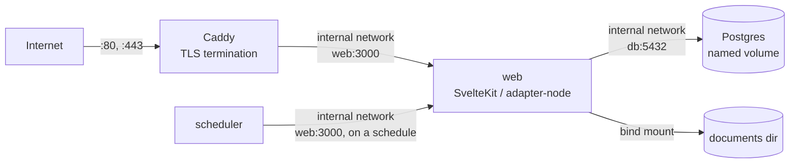

# Production deployment (#76)

This is the second stack alongside the one in AGENTS.md's "Local development"
section, not a replacement for it. `compose.yaml` is still what `pnpm dev` uses: a
bare Postgres for local work. `compose.prod.yaml` is a separate file, with its own
compose project name (`mastro-prod`, vs. `mastro` for dev) so the two can run
side by side without colliding, describing the actual production shape: the app
image built from `Dockerfile`, Postgres on a named volume, and a reverse proxy as
the only thing the network can reach.

## The shape



- **`web`** is built from the repository's `Dockerfile` — a multi-stage build so the
  shipped image never carries `svelte-check`, `eslint`, `vite`, `drizzle-kit` or any
  other devDependency, only the three runtime dependencies in `package.json`
  (`better-auth`, `drizzle-orm`, `postgres`). It publishes to
  `127.0.0.1:${WEB_PORT}:3000` — loopback only.
- **`db`** is `postgres:16-alpine` on the named volume `pgdata`, publishing no port
  at all: nothing but `web` and the backup scripts need to reach it, and both do so
  over the compose network by service name (`db`), never through the host.
- **`scheduler`** (#222) calls `web`'s own cron-shaped endpoints — mail polling,
  the agent drain/enqueue loop, the alert push/digest runs — on an interval, from
  inside the compose network, no published port at all. See "Scheduling" below.
- **`proxy`** is Caddy, the only service with `ports:` bound to every interface. It
  terminates TLS and reverse-proxies to `web:3000` over the same internal network.
  It also mounts `deploy/Caddyfile` as `/etc/caddy/Caddyfile`.

## The trap, and why this avoids it

Publishing a container port with `ports: - "3000:3000"` binds `0.0.0.0` by default.
Docker inserts its own iptables/nftables DNAT rules for that ahead of the host
firewall's `INPUT` chain, so a host firewall that is configured to block 3000 does
not actually block it — the packet is redirected before the firewall rule is ever
consulted. This is a well-known Docker footgun, not specific to this project.

`compose.prod.yaml` avoids it two ways: `web`'s only published port is explicitly
prefixed `127.0.0.1:`, so the DNAT rule only matches traffic already arriving on
loopback; and `db` publishes no port at all, so there is no rule to misconfigure in
the first place. Only `proxy` publishes to every interface, deliberately — it is
the one thing meant to face the internet.

## Secrets

`.env.prod` (copy from `.env.prod.example`, `chmod 600 .env.prod`) holds every
secret: `POSTGRES_PASSWORD`, `BETTER_AUTH_SECRET`, `GOOGLE_CLIENT_SECRET`. It is
never read by `Dockerfile` — `.dockerignore` excludes every `.env*` file from the
build context — so no secret can end up baked into an image layer, and `docker
history`/`docker inspect` on the built image show only the placeholder values the
build stage uses for SvelteKit's postbuild analysis step (see the comment in
`Dockerfile`; those are compile-time only and are discarded when the final
`runtime` stage starts fresh `FROM node:24-alpine`, not built `FROM build`).
Secrets reach the running containers at start, through `env_file: - .env.prod` in
compose, read once by Docker at container creation, never present in the image
itself.

One exception: `runner` (docs/agent-runner.md, "Deploying it") has no
`env_file` at all. It gets an explicit `environment:` block naming only
the handful of variables that service actually reads, each passed
through by name, so none of the credentials above ever reach the
container that spawns the model agent.

```bash
cp .env.prod.example .env.prod
chmod 600 .env.prod
$EDITOR .env.prod
```

## Bringing the stack up

```bash
docker compose -f compose.prod.yaml --env-file .env.prod up -d --build
```

Migrations run on boot: the `web` container's entrypoint is
`node scripts/migrate.ts && exec node build` — the exact same migration runner and
the exact same committed SQL under `drizzle/` that `pnpm db:migrate` runs in local
development, so there is no second migration path that could drift from the first.

## Scheduling (#222)

Three of `web`'s own routes are plain HTTP endpoints that expect a caller: mail
polling (`/api/mail/poll`, #84), the agent drain/enqueue loop (`/api/agent/run`,
#85) and the alert engine's push and digest runs (`/api/alerts/run/push` and
`/api/alerts/run/digest`, #74/#75). Nothing about `docker compose up` calls an
HTTP endpoint on its own, so the `scheduler` service exists to be the caller:
`scripts/scheduler.ts`, a small long-running Node process, built from the same
image as `web` on its own `scheduler` Dockerfile stage. It calls each of the
four routes once immediately on startup, then again on its own interval —
5 minutes for mail polling and the agent loop, 15 minutes for the push job, a
week for the digest (`runAlertDigest` is idempotent, so this only needs to land
roughly weekly, not on a calendar-aligned day). Override any of them in
`.env.prod`: `MAIL_POLL_INTERVAL_MINUTES`, `AGENT_RUN_INTERVAL_MINUTES`,
`ALERT_PUSH_INTERVAL_MINUTES`, `ALERT_DIGEST_INTERVAL_MINUTES`.

`docker compose -f compose.prod.yaml up` starts `scheduler` the same as every
other service in the file — there is no cron entry, systemd timer or extra step
to write by hand. Each of the four routes checks its own bearer token first
(`IMAP_POLL_CRON_TOKEN` for mail polling, `ALERT_CRON_TOKEN` for the other
three — the agent-run route reuses the alert token, see that route's own
comment for why), so a token left unset in `.env.prod` makes `scheduler` skip
that one job and log why, rather than hammer the route with requests it will
only ever refuse.

**Each run is recorded, so a job that stops running is visible.** Mail polling
writes to `mailbox_poll_run` (already existed); the agent loop now writes to
`agent_run`, #222's own addition — the same shape `backup_run` (#77)
established: one row per attempt, `success` or `failure`, and the alert engine
reads the latest row for exactly two conditions, an explicit failure or
staleness (nothing recorded recently enough — the case a failure row can
never cover, because nothing ran to write one).
`detectMailboxPollFailure`/`detectAgentRunFailure`
(`src/lib/server/alerts/detectors.ts`) are what turn either condition into an
alert; stopping either job and waiting past its staleness window (3 hours for
both) raises one, proven directly in `detectors.test.ts`. The alert engine
already had the equivalent check for backups; #222 only added the one table
that was missing.

**The data these tables expose has no settings-page reader yet** — that screen
is #246's, not this one's. Until it lands, `/settings` is still where the
`mailbox_poll_failure`/`agent_run_failure`/`backup_failure` alerts on `/alerts`
link to (`alerts/actions.ts`), the same placeholder the backup alert already
used. The shape #246 has to read is `{ status: 'success' | 'failure', detail:
string | null, acknowledgedAt: Date | null, createdAt: Date }` per job, via
`getLatestMailboxPollRun`/`getLatestAgentRun`
(`src/lib/server/repositories/{mailbox-poll-run,agent-run}.ts`) — the same
shape `getLatestBackupRun`'s caller already reads today, if a backup-health
section exists there already; if not, that gap belongs to #246 too.

**The one gap this cannot close.** If the `scheduler` container itself stops,
nothing calls the alert engine either — the same job that would otherwise
notice `agent_run`/`mailbox_poll_run`/`backup_run` going stale stops noticing
at the same moment, because it is the thing that stopped. This is the same
shape docs/backup.md's "Failure is observable" section already documents for
"the database itself is unreachable": some failure modes are outside what a
database-driven alert engine can ever see about itself. The mitigation is the
same kind, not an alert-engine one: `scheduler`, like every service in
`compose.prod.yaml`, is `restart: unless-stopped`, so the same reboot/restart
guarantee "What was proved locally" describes for `web`/`db`/`proxy` applies to
it too, and `docker compose -f compose.prod.yaml logs scheduler` is where a
self-hoster looks if they suspect it stopped.

**Why a compose service rather than systemd timers.** Both were considered.
Timers would need to be written and installed on the host outside of
`docker compose up` — exactly the extra step #222's acceptance rules out
("no extra step... without anyone writing a cron line by hand"), and would
differ from box to box (systemd unit paths, `systemctl enable --now` for each
of four timers) in a way a single `services:` entry in a file already checked
into this repository does not. A compose service also gets the same
supervision every other service here already has for free (`restart:
unless-stopped`, `docker compose logs`, `docker compose ps`) instead of a
second supervision mechanism (`systemctl status`, `journalctl`) a self-hoster
has to know exists. The tradeoff, stated plainly: `scheduler`'s own crash is
one Docker restart away from recovering, but a fully wedged Docker daemon
takes every scheduled job down with it — the same failure mode the daemon
itself already represents for `web` and `db`, not a new one this design
introduces.

## Reading the logs (#317)

`web`, `scheduler` and the ACP `runner` all write one JSON object per line
to stdout, through the one logging module every server module and deploy
script goes through (`src/lib/server/log/logger.ts`):
`{"time":"2026-08-19T04:02:11.408Z","level":"info","msg":"scheduler: job ok","context":{"job":"mail poll","body":"..."}}`
— `context` present only when the call site passed one. This is a
single-host deployment read with `docker compose logs`, not a service with
anything to aggregate logs for, so JSON lines plus `jq` is the whole
story: no log aggregator, no vendor SDK, no second thing to run.
`--no-log-prefix` drops compose's own `service-1  |` prefix so every line
is exactly the JSON object the process wrote, nothing else on it.

**"What happened at 04:00?"** — every line whose timestamp falls in that
hour, across every service:

```bash
docker compose -f compose.prod.yaml logs --no-log-prefix web scheduler runner \
  | jq -c 'select(.time | startswith("2026-08-19T04"))'
```

**"What happened to the mail poll at 04:00?"** narrows the same query to
the job `scheduler` (`scripts/scheduler.ts`) tags every mail-poll outcome
with, `context.job`:

```bash
docker compose -f compose.prod.yaml logs --no-log-prefix scheduler \
  | jq -c 'select(.context.job == "mail poll" and (.time | startswith("2026-08-19T04")))'
```

Every level writes to stdout, so `docker compose logs` needs no `2>&1` to
see an `error` line; `jq 'select(.level == "error")'` filters to just
those. A context value carrying a connection string or a bearer token —
whatever key it arrives under — is redacted before the line is ever
written; see `src/lib/server/log/logger.test.ts` for the guarantee.

## What was proved locally

Run on this box, `MASTRO_SITE_ADDRESS=localhost` and `MASTRO_TLS_ARG=internal`
(Caddy's self-signed local CA, since there is no real public domain here), proxy
published on `8080`/`8443` instead of `80`/`443` to avoid needing root or colliding
with other services already running on this shared box. Production would use a real
domain, an email for Let's Encrypt, and ports 80/443 (both required: 80 for the ACME
challenge and the redirect Caddy adds by default).

**Unreachable except through the proxy:**

```
$ docker compose -f compose.prod.yaml --env-file .env.prod ps
NAME                  PORTS
mastro-prod-db-1      5432/tcp
mastro-prod-proxy-1   0.0.0.0:8080->80/tcp, 0.0.0.0:8443->443/tcp
mastro-prod-web-1     127.0.0.1:3001->3000/tcp

$ curl -sk https://localhost:8443/health
{"status":"ok","database":"ok"}                    # through the proxy: works

$ curl --max-time 3 http://<this host's public IP>:3001/health
curl: (7) Failed to connect                         # web's port, from off-box: refused

$ ss -tlnp | grep -E ':3001|:8080|:8443'
LISTEN 0.0.0.0:8443     # proxy, every interface — the one thing meant to be
LISTEN 127.0.0.1:3001   # web, loopback only
LISTEN 0.0.0.0:8080     # proxy, http (redirects to https)
```

`db` publishes no port, so there was nothing to check there beyond `docker compose
ps` showing no host mapping. A TCP connection to the proxy's port from the box's
real public interface (not just loopback) also succeeded (the TLS handshake itself
then fails with a certificate-hostname mismatch, because the self-signed local
certificate is scoped to `localhost` — expected for this rehearsal, and irrelevant
to the point being proved, which is that the port is genuinely open on every
interface and `web`'s is not).

**`docker compose restart`:** ran it against all three services; all three come back
and `GET /health` through the proxy returns `{"status":"ok","database":"ok"}`
afterward.

**The reboot claim, stated honestly:** I did not reboot this box, and would not —
it is shared with other work in progress. What actually guarantees the stack
survives a reboot is two independent, already-verified facts rather than a reboot
test: every service in `compose.prod.yaml` is `restart: unless-stopped`, which tells
the Docker daemon to restart a container that was running (not manually stopped)
whenever the daemon itself (re)starts; and `systemctl is-enabled docker` on this box
reports `enabled`, meaning `docker.service` itself is started by systemd on boot
without anyone asking it to. Chained together — the daemon starts because systemd
starts it, and the daemon then restarts every `unless-stopped` container that was
running when it last saw them — this is the standard, documented mechanism a reboot
relies on, and I tested container restart (`docker compose restart`) directly and
daemon-triggered restart indirectly (`systemctl is-enabled`), rather than the
reboot itself.

**Secrets file permissions:** `chmod 600 .env.prod` was applied, and `.env.prod` is
excluded from the Docker build context by `.dockerignore` and from git by
`.gitignore` (`.env.*`, with `.env.example`/`.env.prod.example` explicitly
un-ignored as the templates).

**Scheduling, rehearsed:** brought up `db`, `web` and `scheduler` fresh (a scratch
compose project, volumes included) with every cron token set and dummy
SMTP/IMAP credentials, no manual step beyond `up`. `docker logs scheduler`
within seconds of startup:

```
scheduler: starting, base url http://web:3000, jobs: mail poll every 1m, agent run every 1m, alert push every 1m, alert digest every 1m
scheduler: mail poll ok: {"status":"skipped","reason":"no folders configured","folders":[]}
scheduler: agent run ok: {"drained":{"applied":0,"skipped":0,"failed":[],"rejectedDays":[]},"queued":{"enqueued":0,"alreadyProposed":0}}
scheduler: alert push ok: {"attempted":1,"delivered":0,"prunedSubscriptions":0}
scheduler: alert digest responded 500: {"message":"Internal Error"}
```

Mail polling skips cleanly (no contract has a folder mapped on a fresh
database — correct, not a bug). The digest 500 is `getaddrinfo ENOTFOUND
smtp.rehearsal.invalid`, the deliberately-fake SMTP host this rehearsal used —
expected, and exactly what a self-hoster with real credentials would not see.
`select * from agent_run` afterward showed one `success` row with detail
`drained 0 applied, 0 skipped; queued 0, 0 already proposed`, confirming the
run-record path this section documents actually writes.

**What the first attempt at this rehearsal caught:** `/api/agent/run` 500'd
with `EACCES: permission denied, mkdir 'data/runner-queue'` — `web` had no
volume mounted at `RUNNER_QUEUE_DIR`'s default path at all, a bug nothing
caught before because nothing had ever called that route in production. After
mounting the `runner_queue` volume into `web` too, the _next_ layer of the
same bug showed up (`mkdir 'data/runner-queue/pending'`, same error): a fresh
named volume's mount point is created `root:root`, and both `web` and
`runner` run as non-root `mastro`. Fixed at the image level — `Dockerfile`'s
`runtime` and `runner` stages now `mkdir`+`chown` that path before `USER
mastro`, so Docker's own "a named volume inherits the ownership already
sitting at that path in the image" behavior gives `mastro` write access from
the first mount. Re-ran the same rehearsal against a fresh volume afterward
(the log above) to confirm the fix, not just the reasoning behind it.

## Bringing the stack down

```bash
docker compose -f compose.prod.yaml --env-file .env.prod down     # keep the volumes
docker compose -f compose.prod.yaml --env-file .env.prod down -v  # also destroy them
```

## Releasing: push a tag, the pipeline does the rest

The instance on `prodbox` is deployed by CI, not by hand. There is one path and it
starts with a tag:

```bash
git switch main && git pull
git tag v0.2.0 && git push origin v0.2.0
```

`.github/workflows/deploy-prod.yml` picks that up, refuses to go any further unless
`ci.yml` is a completed success **for that exact commit**, and then runs
`scripts/deploy-prod.sh` on a self-hosted runner living on the box. The script
rsyncs the tag's source into `/opt/apps/mastro`, builds the image there, brings
`db`, `web` and `scheduler` up (see "Two host shapes" below for why not
`proxy`, and "The scheduler service"/"The runner service" for `scheduler`/
`runner`'s own conditions), and gates the result on two separate facts:
`/health` answers 200, and the container that answered is running the image
this run just built. A green `/health` alone would pass just as happily
against yesterday's container, which is the whole reason the second check
exists.

`/health` itself (#316) makes two checks, each its own key in the body:
`database` is a real `select 1` round trip; `storage` writes a small probe
file under `DOCUMENTS_DIR`, reads it back and deletes it — the same
non-destructive write/read/delete `scripts/check-storage.ts` already does
once at boot, run again here on every poll so a disk that fills up _after_
boot still turns this red, not just one that was already full at startup.
Either check failing answers 503 with `{"status":"error",...}` instead of
200 with `{"status":"ok","database":"ok","storage":"ok"}`, and
`scripts/deploy-prod.sh`'s health loop (`curl -fsS`, matching on
`"status":"ok"`) treats a 503 exactly like no answer at all: it keeps
polling, then rolls back if the container never turns green. A full disk
or an unwritable `DOCUMENTS_DIR` breaks document archival — invariant 4's
entire foundation — as surely as an unreachable database breaks
everything else, so the deploy gate does not distinguish between them when
deciding whether to proceed; only the JSON body's `database`/`storage`
keys say which one it was.

If either check fails after the containers were recreated, the script puts the
previous image back, brings the stack up on it and exits non-zero. Nothing before
that point changes anything live.

**`/opt/apps/mastro/DEPLOYED.json` is what is actually running.** The deploy
directory is not a git checkout, so there is nothing else on the box to ask:

```bash
ssh prodbox 'cat /opt/apps/mastro/DEPLOYED.json'
```

**Rolling back** is a tag, not a special mechanism: push a tag on the commit you
want back and let the same pipeline deploy it. To do it by hand in a hurry, the
previous image is still on the box (`docker image ls mastro-prod-web`), and
`docker tag <id> mastro-prod-web:latest` followed by
`docker compose -f compose.prod.yaml --env-file .env.prod up -d --no-build
--force-recreate web` puts it back.

### `ORIGIN`, and the 403 that hides behind a reverse proxy

Set `ORIGIN` in `.env.prod` to the public URL, exactly as a browser sees it.
`adapter-node` compares it against the `Origin` header on every form POST and
answers 403 when they disagree. Behind a proxy that terminates TLS the app only
ever sees plain HTTP on a loopback port, so it guesses the wrong origin and
**every form in the product fails**: recording a day, creating a client, marking
an invoice paid. A GET-only smoke test cannot see this, which is exactly how it
survived the first deploy.

### Two host shapes, and which one prodbox uses

`compose.prod.yaml` ships its own `proxy` service, and that is the right default
for a self-hoster whose box runs nothing else: one `docker compose up` and TLS is
handled.

`prodbox` is the other shape. It already runs Caddy on the host as the single edge
for every application on it, and two processes cannot both hold 443, so the deploy
script starts `db`, `web` and `scheduler` (`proxy` excluded, `runner` conditional
— see "The scheduler service" and "The runner service" below). The host Caddy has
a vhost for `mastro.lorenzofiore.io` that reverse-proxies to `127.0.0.1:5192`,
which is the loopback port `WEB_PORT` publishes there. Nothing about the app
changes between the two shapes; only who terminates TLS does.

The port is 5192 rather than this project's own 5187 because that box already gives
5187 to another application's preview environment. On a box of your own, keep 5187
and the two match.

### The scheduler service

Unlike `runner` below, `scripts/deploy-prod.sh` starts `scheduler` unconditionally,
the same as `db` and `web`: an unset cron token makes it skip that one job and log
why (`scripts/scheduler.ts`'s own comment), never crash-loop, so there is no
"nothing to do" case worth leaving it stopped for. See "Scheduling" above for what
it calls and on what interval.

### The runner service

`scripts/deploy-prod.sh` starts the ACP runner only when `.env.prod` sets
`RUNNER_AGENT_COMMAND`. With no model agent configured it would have nothing
to do, and a container restarting forever is worse than an absent one: #82's own
acceptance is that the product degrades to manual entry when the runner is not
there. Configure the command and the next deploy brings it up.

## Tag only once the trunk's own CI is green

`deploy-prod.yml` refuses a tag whose `ci.yml` run for the same commit is not a
completed success, and that check is the only automated gate between an untested
commit and production, so it is deliberately unforgiving. It also catches an
ordering mistake that looks like a broken pipeline: tagging immediately after a
squash merge races the trunk's own CI run, so the deploy starts, sees
`status=in_progress`, and refuses.

Measured, not theorised: `v0.10.1` failed exactly that way, `ci.yml for
0ba2ba3: status=in_progress conclusion=null`, seconds after the merge. Nothing
was wrong with the tag or the commit.

So: merge, wait for main's `ci.yml` to finish, then tag. If you already tagged
and hit this, the tag is fine and needs no replacement — re-run the failed
`deploy-prod` run once CI is green.
